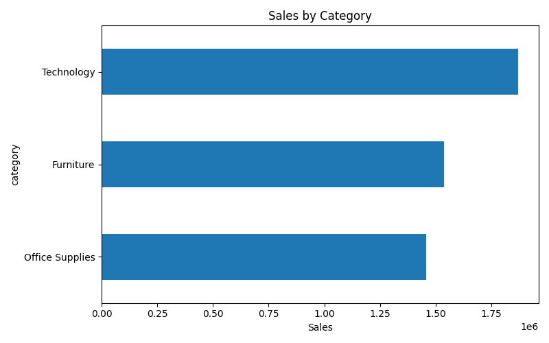
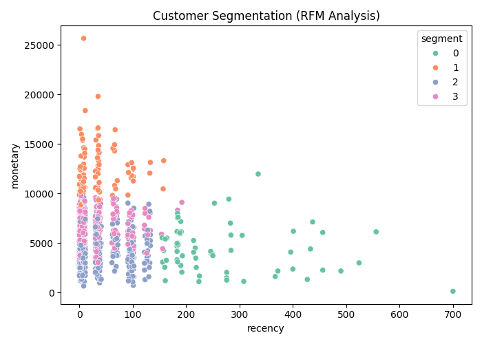
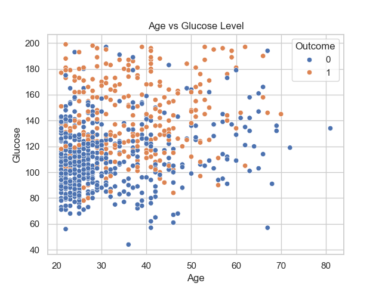
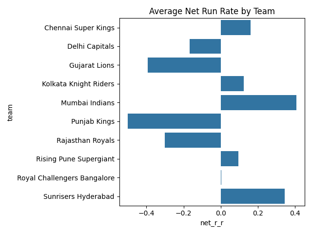
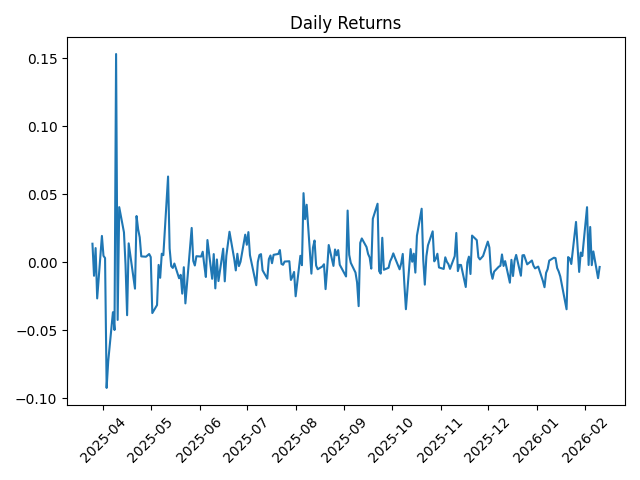
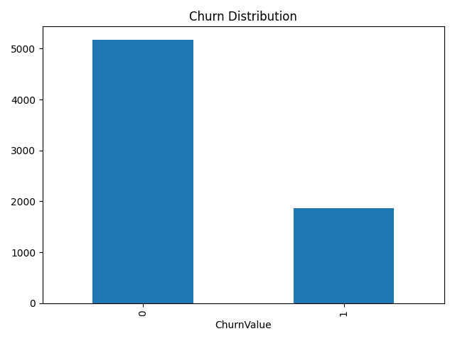
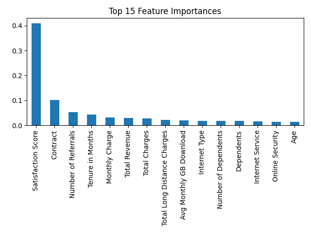

# Complete-Data-Analysis-Portfolio
Welcome to my Data Analysis & Machine Learning Portfolio, a structured collection of real-world analytics projects developed across five weeks.
This repository demonstrates applied skills in data analysis, visualization, statistical reasoning, and predictive modeling using Python building here a professional portfolio of 5+ data analysis projects from different domains (business, healthcare, sports, finance, e-commerce) showcasing end-to-end data analysis, visualization, and business insight generation

## 👨‍💻 Developed By
SANCHAYAN GHOSH

## 📁 Projects Overview

### 📅 Week 1 — Business Sales Analysis
```
Focus Areas: Sales performance evaluation, Revenue trend analysis, Regional comparison, KPI identification

Key Tasks: Data cleaning & preprocessing, Exploratory Data Analysis (EDA), Visualization of revenue patterns, Business insights extraction

📄 Documentation: project1.pdf
```
### 📅 Week 2 — Healthcare Data Analysis
```
Focus Areas: Patient statistics, Treatment outcomes, Healthcare metrics, Risk factor analysis

Key Tasks: Missing data handling, Feature analysis, Correlation study, Visualization of medical indicators


📄 Documentation: project2.pdf
```
### 📅 Week 3 — Sports Analytics
```
Focus Areas: Player performance metrics, Team statistics, Comparative evaluation, Match outcome indicators

Key Tasks: Statistical aggregation, Performance visualization, Efficiency comparisons, Data storytelling

📄 Documentation: project3.pdf
```
### 📅 Week 4 — Financial Market Analysis
```
Focus Areas: Stock price trends, Portfolio evaluation, Risk assessment, Return distribution

Key Tasks: Time-series analysis, Volatility measurement, Investment insights, Trend visualization

📄 Documentation: project4.pdf
```
### 📅 Week 5 — E-commerce Analytics
```
Focus Areas: Customer behavior, Sales patterns, Product performance, Conversion metrics

Key Tasks: Business metric calculation, Visualization dashboards, Pattern detection, Growth insights

📄 Documentation: project5.pdf
```

## 🛠️ Tools & Technologies

### Programming Language: 
```
Python
```
### Libraries Used:
```
Pandas

NumPy

Matplotlib

Seaborn
```
### Techniques Applied:
```
Data Cleaning

Exploratory Data Analysis (EDA)

Data Visualization

Statistical Analysis

Predictive Modeling
```
## 📈 Skills Demonstrated
```
✔ Data Preprocessing
✔ Data Visualization
✔ Statistical Reasoning
✔ Trend Analysis
✔ Domain-Specific Analytics
✔ Insight Generation
```

## 🚀 How to Run the Projects

1️⃣ Clone the repository:
```
git clone https://github.com/sanchayan7432/Complete-Data-Analysis-Portfolio.git
```

2️⃣ Navigate to the project directory:
```
cd <your-repo-name>
```

3️⃣ Run Python scripts:
```
python <project_script_name.py>
```

## 📄 Project Documentation

Each project includes a detailed A4 professional report covering:
```
Objective

Methodology

Tools & Software

Analysis

Visualizations

Key Findings

Conclusion
```

## 🎯 Key Learning Outcomes
```
Applying analytics to multiple industries

Translating raw data into business insights

Designing meaningful visualizations

Understanding domain-specific KPIs

Improving storytelling with data
```

## 📊 Data Insights
















## 📬 Contact

If you’d like to collaborate, discuss projects, or provide feedback:

📧 [sanchayan7432@gmail.com]
🔗 [https://www.linkedin.com/in/sanchayan-ghosh-0b735024a/]

Interactive Dashboard Link
```
https://sanchayan-data-analysis-portfolio-kwrjs7fnehakjwvjkcdd3r.streamlit.app/
```

## ⭐ Acknowledgment

This portfolio reflects continuous learning, structured practice, and real-world problem-solving in Data Analytics & Machine Learning.
